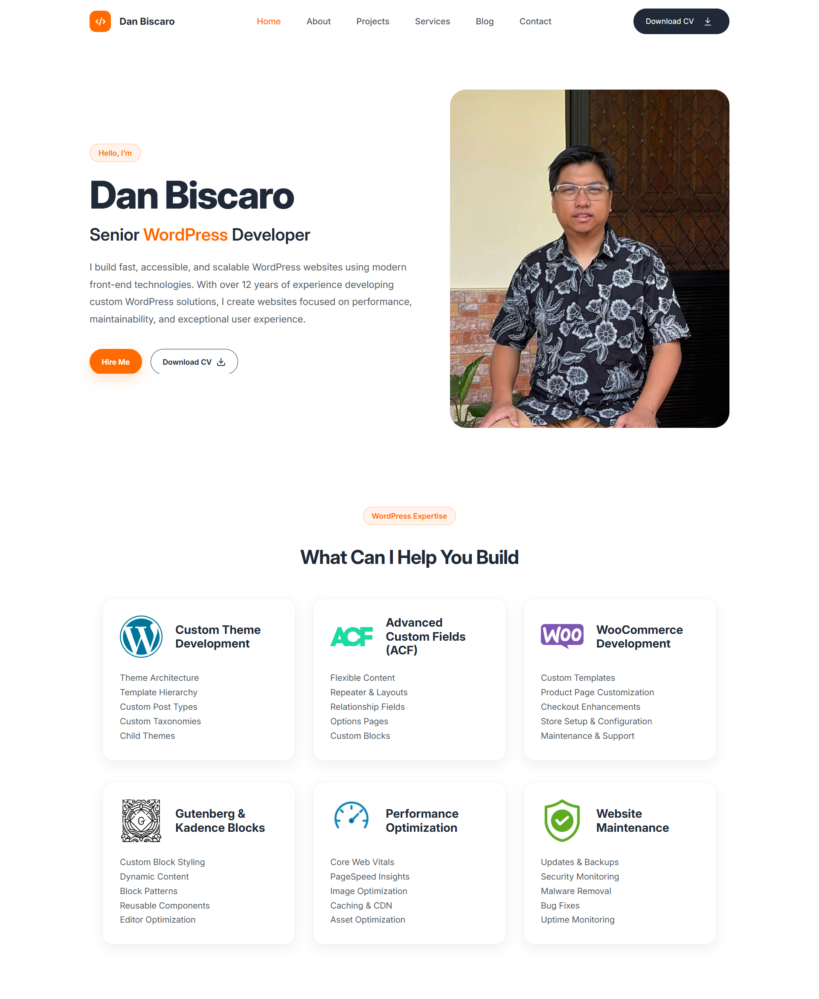

# Portfolio Theme

A custom WordPress portfolio theme built to demonstrate modern WordPress theme development, front-end architecture, accessibility, and performance-conscious development practices.

The theme combines traditional WordPress development with a modern front-end workflow using PHP, SCSS, vanilla JavaScript, ES modules, Vite, Gutenberg, and Kadence Blocks.

## Preview



## Features

- Custom WordPress theme architecture
- WordPress template hierarchy and reusable template parts
- Custom Project post type and taxonomy
- Custom project metadata and metaboxes
- Project filtering, pagination, and shortcodes
- Gutenberg and Kadence block patterns
- Configurable portfolio contact and social settings
- Media Library integration for resume/CV management
- Responsive layouts
- Accessible navigation and keyboard interactions
- Reduced-motion support
- Modular vanilla JavaScript
- SCSS architecture using BEM methodology
- Design tokens for colors, typography, spacing, and components
- Vite development server and production builds
- WordPress editor styles
- Production asset loading through the Vite manifest

## Tech Stack

### WordPress / PHP

- WordPress
- PHP 8+
- WordPress Settings API
- WordPress Options API
- WordPress Media Library API
- Custom Post Types
- Custom Taxonomies
- Post Meta
- Metaboxes
- Shortcodes
- Block Patterns
- Template Parts

### Front End

- HTML5
- SCSS
- BEM
- Vanilla JavaScript
- ES Modules
- Intersection Observer
- CSS Grid
- Flexbox

### Development Tools

- Vite
- Sass
- npm
- Git

## Project Structure

```text
portfolio-theme/
├── assets/
│   ├── css/
│   ├── fonts/
│   ├── images/
│   ├── js/
│   └── scss/
│
├── inc/
│   ├── admin/
│   ├── metaboxes/
│   ├── post-types/
│   ├── shortcodes/
│   ├── block-patterns.php
│   ├── enqueue.php
│   ├── helpers.php
│   ├── theme-setup.php
│   └── vite.php
│
├── page-templates/
├── patterns/
├── template-parts/
│   ├── contents/
│   ├── footer/
│   ├── global/
│   ├── header/
│   └── sections/
│
├── front-page.php
├── functions.php
├── header.php
├── footer.php
├── index.php
├── page.php
├── single.php
├── single-project.php
├── style.css
├── package.json
└── vite.config.js
```

## SCSS Architecture

Styles are organized into modular layers to keep the codebase maintainable and scalable.

```text
assets/scss/
├── abstracts/
├── base/
├── components/
├── layout/
├── pages/
├── sections/
├── editor-style.scss
└── main.scss
```

The theme uses reusable design tokens and utilities for colors, typography, spacing, breakpoints, transitions, shadows, and other common interface values.

Component styles follow a BEM-inspired naming convention.

## JavaScript

JavaScript is written using vanilla JavaScript and ES modules.

Interactive functionality is separated into reusable modules rather than maintained in one large script.

The theme includes functionality such as:

- Mobile navigation
- Sticky header behavior
- Scroll-triggered animations
- Accessible interaction states

Scroll animations use `IntersectionObserver` and respect the user's `prefers-reduced-motion` preference.

## Accessibility

Accessibility was considered throughout the theme development process.

Some of the implemented features include:

- Semantic HTML
- Skip-to-content navigation
- Keyboard-accessible navigation
- Visible `:focus-visible` states
- ARIA attributes for interactive navigation
- Escape-key support for mobile navigation
- Focus restoration
- Reduced-motion support
- Accessible link and button states
- Screen-reader utility classes

## Portfolio Settings

Site-specific information is separated from the theme source code.

The theme provides a settings page under:

**Appearance → Portfolio Settings**

The settings include:

- Email address
- Phone number
- Location
- LinkedIn profile
- GitHub profile
- Resume/CV PDF

The resume can be selected through the WordPress Media Library.

This keeps personal information in the WordPress database rather than hard-coding it into the theme source, making the repository safer and more reusable.

## Development

Install the project dependencies:

```bash
npm install
```

Start the Vite development server:

```bash
npm run dev
```

The development environment uses Vite for asset processing and hot module replacement.

## Production Build

Create production-ready assets with:

```bash
npm run build
```

Vite generates the compiled assets and production manifest inside:

```text
dist/
```

The `dist` directory is intentionally excluded from the repository because it contains generated build files.

The WordPress theme reads the Vite manifest in production to load the appropriate compiled CSS and JavaScript assets.

## Editor Styles

The project also includes a dedicated WordPress editor stylesheet.

Build it manually with:

```bash
npm run editor
```

Or watch the editor SCSS during development:

```bash
npm run editor:watch
```

The standard production build also generates the editor stylesheet.

## Requirements

- WordPress 6.8+
- PHP 8+
- Node.js compatible with the included Vite version
- npm
- Kadence Blocks

## Installation

Clone the repository into your WordPress themes directory:

```bash
git clone <repository-url> portfolio-theme
```

Move into the theme:

```bash
cd portfolio-theme
```

Install dependencies:

```bash
npm install
```

Build the production assets:

```bash
npm run build
```

Then activate **Portfolio Theme** from:

**WordPress Admin → Appearance → Themes**

After activation, configure the site-specific information under:

**Appearance → Portfolio Settings**

## Purpose

This project was created as both my personal portfolio theme and a demonstration of my WordPress development workflow.

The project focuses on:

- Maintainable WordPress architecture
- Reusable components
- Modern front-end development
- Responsive implementation
- Accessibility
- Performance
- Clean and organized source code

It is intended to demonstrate how I approach building custom WordPress themes rather than relying entirely on pre-built themes or page-builder templates.

## Author

**Dan Biscaro**
WordPress Developer

- Portfolio: danbiscaro.com
- GitHub: dknweb
